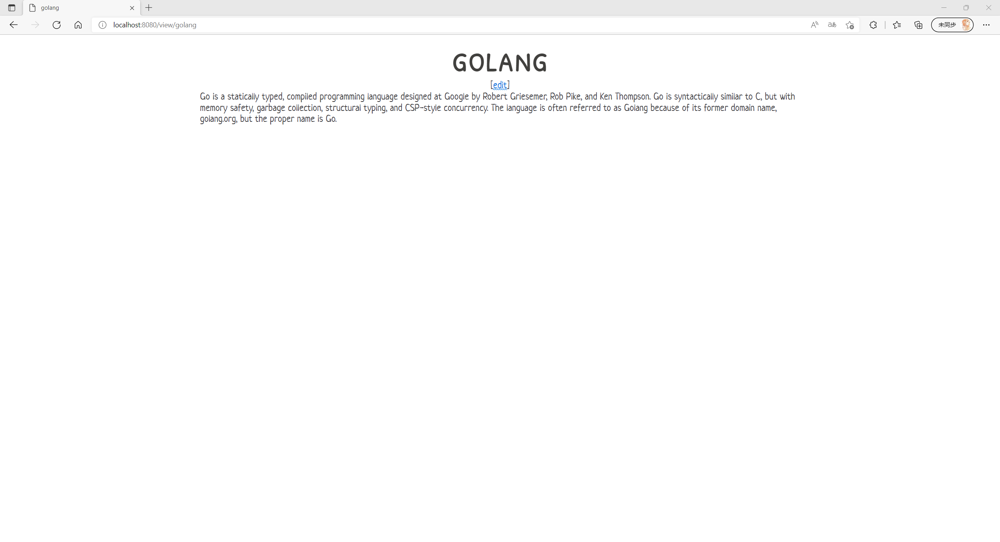
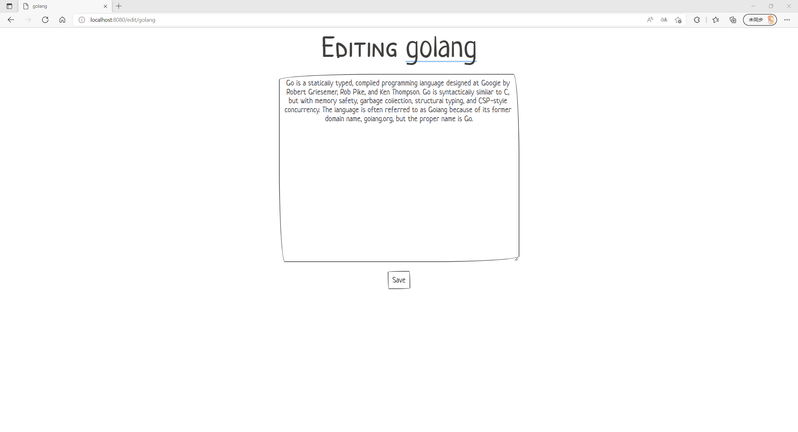

# Wiki GO

简单入门 go web ！

配合以下参考文章很快就能做出本项目。
> 参考：http://shouce.jb51.net/golang-doc/53.html

## 功能
- `/view` : 查看某 wiki，若不存在该 wiki 则进入编辑页面
- `/edit` : 编辑某 wiki，保存成功后跳转至浏览页面 

## 演示

[online demo](http://101.35.202.174:8010/)

## 部署

1. **普通部署**

执行 

`go run wiki.go`

或执行 

`go build wiki.go`

`./wiki`

访问 `http://localhost:8080/` 即可开始

2. **docker 部署**

一个简单的 [Dockerfile](Dockerfile) 已经写好，只需在项目文件夹下执行

`docker build -t congregalis/wiki-go .`

再

`docker run -d -p 8010:8080 --name wiki-go congregalis/wiki-go`

访问 `http://localhost:8080/` 即可开始

## 感谢
- [papercss](https://github.com/papercss/papercss)
- [Docker - 从入门到实践](https://yeasy.gitbook.io/docker_practice/)